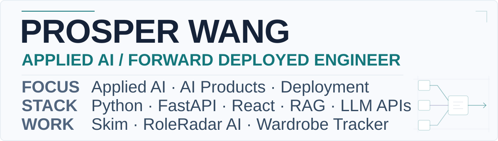

<picture>
  <source media="(prefers-color-scheme: dark)" srcset="assets/hero-dark.svg">
  <source media="(prefers-color-scheme: light)" srcset="assets/hero-light.svg">
  
</picture>

I'm **Prosper Wang**, an engineer focused on applied AI and forward-deployed product work.

I build end-to-end AI products with Python, FastAPI, React, retrieval systems, and LLM APIs.

**Currently looking for:** Forward Deployed Engineer · Applied AI Engineer · AI Product Engineer roles.

## Selected work

### [Skim](https://github.com/prowang01/skim)

Multimodal video Q&A system with retrieval, timestamp citations, and evaluation.

- Local `faster-whisper` transcription + sampled video frames + vision descriptions + embeddings.
- Adaptive retrieval with adjacent and cross-modal context. Saved 7-video / 19-question evaluation: **17.5/19 vs 17.0/19** for a full-context baseline — small judge-scored evaluation, not general superiority.

### [RoleRadar AI](https://github.com/prowang01/roleradar-ai)

Local-first LinkedIn job tracker with browser capture, FastAPI backend, React dashboard, and optional AI role analysis.

- Chrome MV3 → FastAPI / SQLAlchemy / SQLite → React / TypeScript.
- Separate user-triggered OpenAI brief / fit analysis calls using JSON mode; optional profile and extracted resume context for fit analysis. Briefs use job context only.

### [Wardrobe Tracker](https://github.com/prowang01/wardrobe-tracker)

Personal frontend product for tracking clothing purchases, returns, refunds, and resale.

- React + TypeScript + Vite.
- Browser-local `localStorage`, status-derived financial summaries, and deterministic domain tests.

## Experience

### Doctolib — Solutions Engineer Intern, 2026

- Automated testing / reliability for a healthcare EHR data-transformation pipeline: **272 tests** across unit, component, contract, and integration levels.
- Pydantic contract testing across **24 adapter configurations**; GitHub Actions CI/CD.

### H-GenAI Paris — 2nd place

Four-person team building a data-quality anomaly detection / SQL generation prototype at the Sia Partners / AWS / NVIDIA / Mistral AI hackathon. I built the **Streamlit frontend**. [Collaborative repository](https://github.com/Kir-w/HackathonGenAI-WZSolutions).

## Stack

**Languages:** Python · TypeScript · JavaScript · SQL 
**Backend / Product:** FastAPI · React · Streamlit 
**Applied AI:** OpenAI API · RAG · multimodal retrieval · LLM workflows 
**Data / Reliability:** Pydantic · SQLAlchemy · SQLite · GitHub Actions · pytest

## Background

**ESILV** — Computer Science / Data & AI, 2023–2026 
**California State University, Long Beach** — Exchange, 2025

French — native · English — fluent · Mandarin — basic 
Weightlifting · basketball · fashion · travel

## Contact

[LinkedIn](https://linkedin.com/in/prosperwang) · [prosperwangpro@gmail.com](mailto:prosperwangpro@gmail.com)
