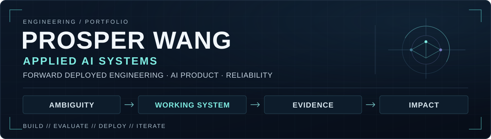

<p align="center">
  
</p>

I'm **Prosper**, an engineer focused on applied AI and forward-deployed product work. I turn ambiguous workflows into working systems, then make the important failure modes visible and testable.

**Currently targeting:** Forward Deployed Engineer · Applied AI Engineer · AI Product Engineer · hands-on AI Solutions / Deployment roles.

## // MISSION

Start with the user's decision or workflow, then build the smallest useful system around it. The model is part of that system: interfaces, data, retrieval, persistence, and reliability matter just as much.

I prefer systems you can inspect, boundaries you can test, and trade-offs you can explain in terms of the user or business outcome.

## // SELECTED SYSTEMS

### [Skim](https://github.com/prowang01/skim) · Multimodal video Q&A

Ask questions about what a video says and shows, with timestamped evidence.

- Local `faster-whisper` transcription and vision-described sampled frames, embedded into one timeline/index.
- Adaptive semantic retrieval with adjacent context and cross-modal temporal expansion; timestamp citations and explicit coverage-gap / motion blind-spot handling.
- Saved evaluation: **17.5/19 vs. 17.0/19** for a full-context baseline, across **7 videos / 19 questions**. A small judge-scored snapshot, not evidence of general superiority.

**Signal:** multimodal retrieval, evaluation, and engineering trade-offs. Cross-encoder reranking was tested and left off by default when the evidence did not justify it.

### [RoleRadar AI](https://github.com/prowang01/roleradar-ai) · Local-first job tracking & role analysis

Capture a LinkedIn posting, track the application, and decide whether the role deserves attention.

- Chrome MV3 integration with multi-strategy DOM extraction → FastAPI + SQLAlchemy/SQLite → React/TypeScript dashboard with a drag-and-drop pipeline.
- Deterministic mock analyzer; optional OpenAI brief and fit analysis are **separate, user-triggered calls using JSON mode**. Fit analysis can use profile and extracted resume context and returns one overall score/verdict; briefs use job context only.
- A saved brief can enrich later fit analysis but is optional. Backend smoke tests cover the local workflow; extraction and AI limitations are documented explicitly.

**Signal:** end-to-end product engineering, browser integration, persistence, and human-in-the-loop AI design around an unstable external interface.

### [Wardrobe Tracker](https://github.com/prowang01/wardrobe-tracker) · Purchase lifecycle & frontend product

A personal tracker for clothing purchases, returns, and refunds.

- React + TypeScript + Vite; browser-local `localStorage` persistence.
- Nine lifecycle statuses drive financial summaries, filtering, and brand insights, with deterministic domain tests.

**Signal:** product ownership, usable workflows, and frontend state / domain modeling.

## // FIELD SIGNAL

**Doctolib · Solutions Engineer Intern, 2026**<br>
Reliability and testing for a healthcare EHR data-transformation pipeline: an automated framework with **272 tests** across unit, component, contract, and integration levels; Pydantic contract testing across **24 adapter configurations**; GitHub Actions CI/CD.

**H-GenAI Paris · 2nd place, four-person team**<br>
Built a data-quality prototype around anomaly detection and SQL generation during the Sia Partners / AWS / NVIDIA / Mistral AI hackathon. I built the **Streamlit frontend**. [Collaborative repository](https://github.com/Kir-w/HackathonGenAI-WZSolutions).

## // OPERATING MODEL

```text
AMBIGUITY
  → frame the decision / workflow
  → build the smallest useful system
  → evaluate failure modes
  → harden the boundaries
  → iterate from evidence
```

I use AI tools as leverage for implementation and exploration, then verify outputs at important system boundaries: data contracts, model responses, persistence, and user-visible behavior.

## // TOOLKIT

| Area | Tools & practices |
| --- | --- |
| Languages | Python · TypeScript · JavaScript · SQL |
| Product & APIs | FastAPI · React · Streamlit |
| Applied AI | OpenAI API · RAG · multimodal retrieval · LLM workflows |
| Data & contracts | Pydantic · SQLAlchemy · SQLite |
| Verification | pytest / unittest · GitHub Actions |
| Data & ML | NumPy · pandas · scikit-learn |

## // BACKGROUND

**ESILV** · Computer Science / Data & AI, 2023–2026<br>
**California State University, Long Beach** · Exchange, 2025

**Languages:** French — native · English — fluent · Mandarin — basic.<br>
**Outside code:** weightlifting, basketball, fashion, and discovering new places.

## // CONNECT

[LinkedIn](https://linkedin.com/in/prosperwang) · [prosperwangpro@gmail.com](mailto:prosperwangpro@gmail.com)
